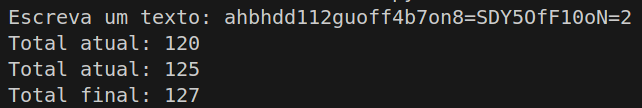

# Somador on/off
## A104445 - Alexandre Marques Miranda
### 
### 13/2/2025

Para a resolução deste TPC, recorreu-se à entrada de texto pelo terminal e a impresssão das respetivas respostas também no terminal.

Foram definidas 5 variáveis que permitiram a análise do texto:
- "o" - verifica a ocorrência do caracter "o" no texto.
- "of" - verifica a ocorrência da expressão "of" no texto.
- "on" - verifica a ocorrência da expressão "on" no texto. Esta flag permite detetar se os números que aparecerem devem ser considerados para a soma ou não.
- "num" - guarda a string de números para serem mais tarde convertidos em inteiros. Isto permite somar as ocorrências de números em vez de somar apenas os algarismos que ocorrem no texto.
- "total" - permite calcular a soma dos números encontrados no texto.

O programa desenvolvido analisa o texto um caracter de cada vez e utiliza as variáveis explicadas acima para determinar a soma dos números do texto fornecido.

