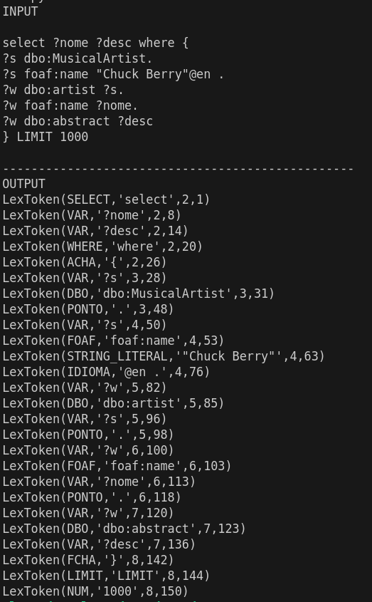

# Analisador Léxico
## A104445 - Alexandre Marques Miranda
### 
### 8/3/2025

Para a resolução deste trabalho, foi criado o ficheiro TPC4. Este ficheiro está dividido em 2 partes principais:

- divisão dos tokens
- definição da expressão regular dos tokens

Em relação à divisão de tokens, foram definidos os tokens para as palavras reservadas como "select", "where" e "LIMIT", as variáveis que começam por '?', as propriedades de DBO e FOAF, as chavetas a abrir e a fechar, o ponto, as strings, os idiomas, os numeros e os atalhos.

Para as expressões regulares dos tokens, foram utilizadios os símbolos "{", "}", "." para as chavetas a abrir, a fechar e para o ponto, respetivamente, a letra 'a' para os atalhos, as palavras "select", "where", "LIMIT" para as palavras reservadas, as variáveis, que começam por '?' e possuem pelo menos uma letra, as propriedades de dbo e foaf começam pela respetiva propriedade, seguidas de ':' e por fim o nome associado, os números que são uma sequência de dígitos, as strings que estão entre """ e os idiomas que vêm após o '@'.  

