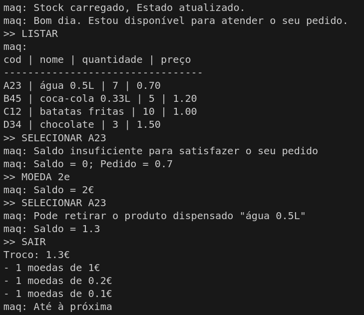

# Máquina de Vending
## A104445 - Alexandre Marques Miranda
### 
### 15/3/2025

Para a realização deste TPC foram criados os ficheiros TPC5.py e o stock.json.

O ficheiro stock.json é utilizado para definir o conteúdo da máquina de vendas e para ser atualizado à medida que são feitas as operações.

O ficheiro TPC5.py está dividido em 2 partes principais:

- Funções auxiliares
- Função main

Estão definidas 4 funções auxiliares:

- lerJson -> esta função carrega os dados do ficheiro json
- salvaJson -> esta função atualiza os dados do ficheiro json
- calculaSaldo -> esta função recebe a string de moedas inseridas e calcula o saldo atualizado
- calculaTroco -> esta função recebe o que sobrou de saldo após as operações e indica o saldo que sobrou e em que moedas pode ser levantado

Na função main, é chamada a função para ler o ficheiro com o stock e enquanto que o utilizador não pretende sair, o programa fica à espera que este selecione alguma opção. Após essa seleção, é verificado se o comando é valido. 

Os diferentes comandos são:

- LISTAR -> apresenta o stock carregado
- MOEDA -> carrega o saldo
- SELECIONAR -> seleciona o item escolhido
- SAIR -> atualiza o stock e indica o saldo a recolher

Ficheiro com o stock: [Stock](stock.json)
