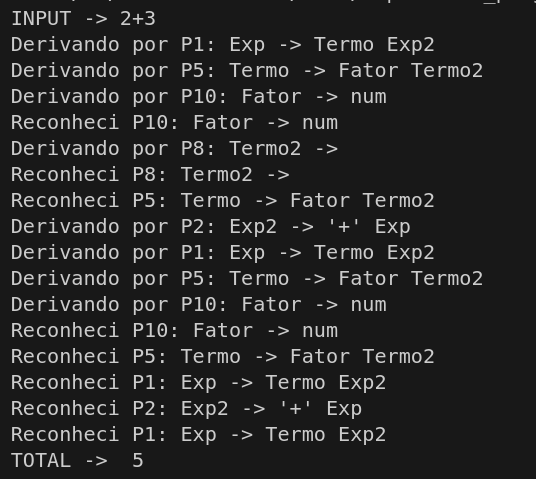
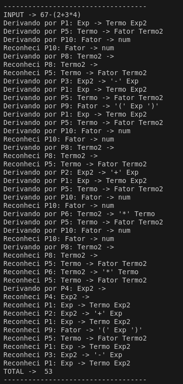
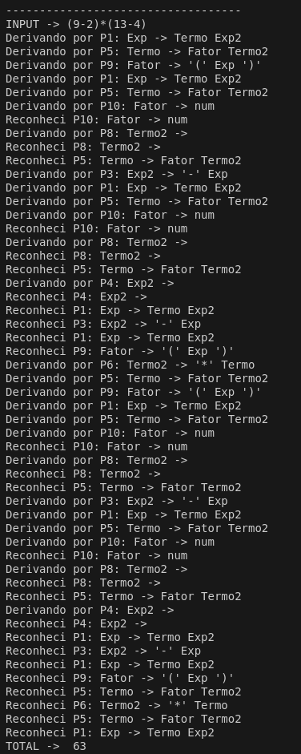

# Recursivo Descendente para expressões aritméticas
## A104445 - Alexandre Marques Miranda
### 
### 22/3/2025

Para este TPC, foram criados os ficheiros TPC6_analex.py, TPC6_anasin.py, TPC6_ast e TPC6_program.

O ficheiro TPC6_analex.py contém a análise lógica que foi utilizada. Para isso, determinaram-se os seguintes tokens:

- NUM -> Números das expressões aritméticas ('\d+'')
- PA -> Parentesis a abrir ('(')
- PF -> Parentesis a abrir (')')
- ADD -> Sinal de adição ('+')
- MULT -> Sinal de multiplicação ('*')
- SUB -> Sinal de  subtração ('-')
- DIV -> Sinal de divisão ('/')
- FIM -> Final da expressão ('$')

O ficheiro TPC6_anasin.py permite representar a estrutura gramatical desenvolvida. Com isso, chegou-se à seguinte estrutura: 

- P1: Exp -> Termo Exp2 (expressão inicial)
- P2: Exp2 -> '+' Exp (sinal de adição antes da expressão)
- P3: Exp2 -> '-' Exp (sinal de subtração antes da expressão)
- P4: Exp2 -> (expressão vazia)
- P5: Termo -> Fator Termo2 (parte da expressão)
- P6: Termo2 -> '*' Termo (sinal de multiplicação antes do termo)
- P7: Termo2 -> '/' Termo (sinal de divisão antes do termo)
- P8: Termo2 -> (termo vazio)
- P9: Fator -> '(' Exp ')' (expressão entre parentesis)
- P10: Fator -> num (número)

No ficheiro TPC6_ast, foram definidas as seguintes classes para se poder calcular o resultado das expressões aritméticas:

- Exp -> representa uma expressão genérica
- Num -> representa um número inteiro dentro da expressão
- BinOp -> representa uma operação binária(soma, subtração, multiplicação ou divisão)

O ficheiro TPC6_program tem uns exemplos de expressões aritméticas e executa o código desenvolvido nos outros ficheiros.

